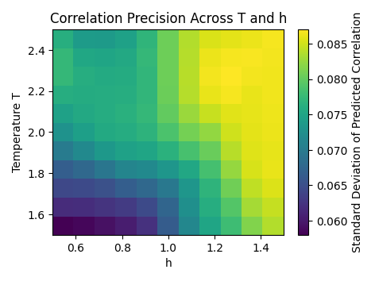

# Qtomography-AI

Utilizing AI to explore Quantum Many-body Systems

## Welcome

Welcome to **Qtomography-AI**! This project leverages artificial intelligence to investigate quantum many-body systems, specifically focusing on the Ising model and its Gibbs states.

### Getting Started

Follow these steps to set up and run the project:

1. **Clone the Repository**:
    ```bash
    git clone https://github.com/yaoyaodedaqiuqiu/Qtomography-AI.git
    cd Qtomography-AI
    ```

2. **Set Up a Virtual Environment**:
    - **Using `venv`**:
        ```bash
        python -m venv venv
        ```
    - **Activate the Virtual Environment**:
        - **On Windows**:
            ```bash
            .\venv\Scripts\activate
            ```
        - **On macOS/Linux**:
            ```bash
            source venv/bin/activate
            ```

3. **Install Dependencies**:
    ```bash
    pip install -r requirements.txt
    ```

4. **Run the Training Script**:
    ```bash
    python train.py
    ```

5. **Run the Testing Script**:
    ```bash
    python test.py
    ```

6. **View Example Results**:

    After running the testing script, you can find the generated correlation plots in the `figure_test` directory. Below are some example results:

    #### Heatmap of Predicted Correlation `<σ₁ᶻ σ₂ᶻ>`

    

    *Heatmap: Predicted Correlation `<σ₁ᶻ σ₂ᶻ>` Across Temperature T and Transverse Field h.*

    #### Correlation Functions for Specific h Values


    

    *Figures: Predicted vs True Correlation Functions for Specific h Values.*

    #### Precision Heatmap

    

    *Heatmap: Standard Deviation of Predicted Correlation Across Temperature T and Transverse Field h, indicating prediction precision.*

## Updates

### Update 2.2 : 2025/1/9

- **Integrated `CorrelationDatasetPyTorch` into `dataset.py`**:
    - Moved the `CorrelationDatasetPyTorch` class definition into the `dataset.py` module to streamline imports and avoid redundancy.
    - Fixed the previous import error by ensuring that all necessary classes and functions are properly exported from `dataset.py`.

- **Updated `test.py`**:
    - **Enhanced Plotting Capabilities**: Modified the testing script to generate comprehensive plots, including:
        - **Heatmap of Predicted Correlation**: Visualizes how the predicted correlation `<σ₁ᶻ σ₂ᶻ>` varies with temperature `T` and transverse field `h`.
        - **Critical Point Analysis**: Focuses on `h=0.5` to analyze the model's performance near the phase transition point.
        - **Precision Heatmap**: Shows the standard deviation of predicted correlations across `T` and `h`, indicating the precision and consistency of the model's predictions.
    - **Figure Naming Consistency**: Ensured that all figure filenames are formatted with one decimal place for temperature values (e.g., `correlation_functions_h0.1.png`) to maintain clarity and avoid long decimal numbers.
    - **Directory Management**: Verified that all generated figures are saved in the `figure_test` directory with appropriate subdirectories if necessary.


- **Bug Fixes and Enhancements**:
    - Fixed the issue with filename formatting in `test.py` to prevent errors when loading and saving figures.
    - Enhanced logging to provide more detailed information during the testing and plotting processes.

#### `train/`

Contains scripts related to training the AI models, including the main training loop, evaluation, and visualization tools.

#### `model/`

Houses the neural network architectures used for predicting correlations in the quantum many-body system.

#### `dataset/`

Includes scripts for generating and processing the Gibbs state data, simulating quantum measurements, and preparing datasets for training. Now also contains the `CorrelationDatasetPyTorch` class for dataset management.

#### `test/`

Contains scripts and utilities for generating test data, evaluating the trained models, and visualizing the results.

### Previous Updates

#### Update 2.1 : 2025/1/9

- **Modified `train.py`**:
    - **Data Utilization**: Configured the training script to use 100% of the generated data for training, eliminating the validation and testing split.
    - **Removed Validation Phase**: The validation and testing phases have been removed from the training process to streamline training.
    - **Enhanced Logging**: Improved logging to provide more detailed training progress and performance metrics.
  
- **Added `test.py`**:
    - **Data Generation for Testing**: Introduced a new script to generate test data with specific parameters:
        - `N = 9`
        - `J_list = [1.0, 1.5, 2.0]`
        - `h_list = np.linspace(0, 1, 6)`
        - `t_list = [1.2, 1.8, 2.5]`
    - **Model Evaluation**: The script loads the trained model parameters and evaluates the model on the newly generated test data.
    - **Visualization**: Generates and saves plots comparing the true and predicted correlation terms for the test data.
    - **Figure Naming Fix**: Ensured that figure filenames are formatted with one decimal place for temperature values to maintain consistency and readability.
    - **Directory Management**: Ensures that test data and visualizations are saved in designated directories for better organization.

- **Project Structure Enhancements**:
    - **`test/` Directory**: Created a new directory to house the `test.py` script and related utilities.
    - **Documentation Updates**: Updated documentation to reflect the addition of the testing phase and provide guidance on how to execute it.
    - **Figure Naming Fix**: Updated `test.py` to format temperature values in figure filenames to one decimal place, ensuring cleaner and more readable filenames.

##### `train/`

Contains scripts related to training the AI models, including the main training loop, evaluation, and visualization tools.

##### `model/`

Houses the neural network architectures used for predicting correlations in the quantum many-body system.

##### `dataset/`

Includes scripts for generating and processing the Gibbs state data, simulating quantum measurements, and preparing datasets for training.

##### `test/`

Introduced for generating test data, loading trained models, evaluating performance, and visualizing results.

#### Update 2.0 : 2024/12/15

- **Updated `requirements.txt`**: Ensured all necessary dependencies are listed and removed any redundant packages.
- **Reorganized Project Structure**: Streamlined the repository by organizing all code into four main directories:
    - **`train/`**: Contains training scripts and related utilities.
    - **`model/`**: Houses model definitions and architectures.
    - **`dataset/`**: Includes data generation and processing scripts.
    - **`test/`**: Introduced for testing scripts and evaluation tools.
- **Cleaned Up Files**: Removed previously redundant files to maintain a clean and efficient codebase.
- **Introduced New Documentation**: Provided brief introductions for each of the four main directories.

##### `train/`

Contains scripts related to training the AI models, including the main training loop, evaluation, and visualization tools.

##### `model/`

Houses the neural network architectures used for predicting correlations in the quantum many-body system.

##### `dataset/`

Includes scripts for generating and processing the Gibbs state data, simulating quantum measurements, and preparing datasets for training.

##### `test/`

Introduced for generating test data, loading trained models, evaluating performance, and visualizing results.

#### Update 1.0 : 2024/11/26

##### `dataset.py`

A series of classes have been designed to simulate and generate Gibbs states, implementing the following functions:
- An interface for importing the Hamiltonian of different many-body models, with the Ising model currently defined.
- The ability to perform a temperature gradient scan under the Gibbs state, with customizable temperature range and step size.

##### `model.py`

A simple Multi-Layer Perceptron (MLP) architecture is employed to predict the temperature of Gibbs states. The model consists of two hidden layers and an output layer, using the ReLU activation function and Dropout to prevent overfitting. The input is a flattened matrix of Gibbs states, and the output is the corresponding temperature value, making it a regression problem.

##### `train.py`

The following functions are defined in `train.py`:
- **load_gibbs_states()**: Loads Gibbs state data from a `.pkl` file.
- **preprocess_data()**: Flattens and standardizes the Gibbs state matrix to prepare it as input for the neural network.
- **train()**: Defines the training process, including forward propagation, loss calculation, backpropagation, and optimization steps.
- **save_model()**: Saves the trained model to a file for later use.

#### Update 0.0 : 2024/11/22

Uploaded the previous code and trial for exploring GCN in the Ising model.

##### `Ising_dataset.py`

This Python script generates a dataset for the 9-qubit Ising model, simulating quantum measurements and the computation of the ground state energy for random Hamiltonians. The script includes functions to:

1. **Construct the Ising Hamiltonian**: The `build_ising_hamiltonian` function generates the Ising Hamiltonian matrix for a given set of coupling strengths `J` and transverse field strengths `h`.
2. **Compute the Kronecker product**: The `kron_n` function computes the Kronecker product of multiple matrices, which is essential for constructing the Hamiltonian in the tensor product space.
3. **Simulate Random Pauli Measurements**: The `measure_random_pauli` function simulates measurements on randomly chosen qubits with random Pauli operators (X, Y, Z). The outcome is determined based on the expectation value of the Pauli operator.
4. **Generate the Ising Dataset**: The `generate_ising_dataset` function creates a dataset of quantum states, where each sample consists of the measurement qubits, the measurement result, the Hamiltonian matrix, and the corresponding target eigenvalue (ground state energy).

##### `Ising_train.py`

This Python script implements a Graph Neural Network (GNN) using PyTorch to predict the minimum eigenvalue (ground state energy) of the Ising model Hamiltonian based on quantum measurement results. The key components of the code include:

1. **GNN Model**: The `GNNModel` class defines a graph neural network with two layers of `GCNConv`, followed by a global mean pooling layer and a fully connected layer to predict a scalar value (the ground state energy). It also learns edge features via a parameterized tensor.

2. **Graph Construction**: The `create_full_graph` function constructs a full graph representation of the quantum system, where each qubit is a node, and edges are created between all pairs of qubits. The measurement results are used as node features, and all edges are initialized with the same feature.

3. **Training and Testing**: 
   - The `train` function performs a forward pass, computes the loss using the Mean Squared Error (MSE) between the model's prediction and the target (the ground state energy), and updates the model's parameters.
   - The `test` function evaluates the model's prediction on the first sample of the dataset and compares it with the ground truth.

4. **Data Loading**: The `load_dataset` function loads the Ising model dataset from a pickle file, and the `get_batches` function yields data in mini-batches for training.

5. **Training Loop**: The model is trained over a specified number of epochs, and the loss is printed after each epoch.

##### `draw.py`

##### `trial.ipynb`

##### `requirements.txt`

