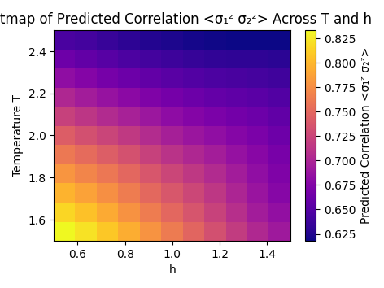
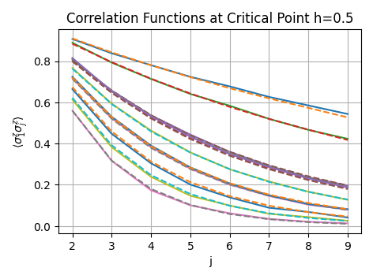
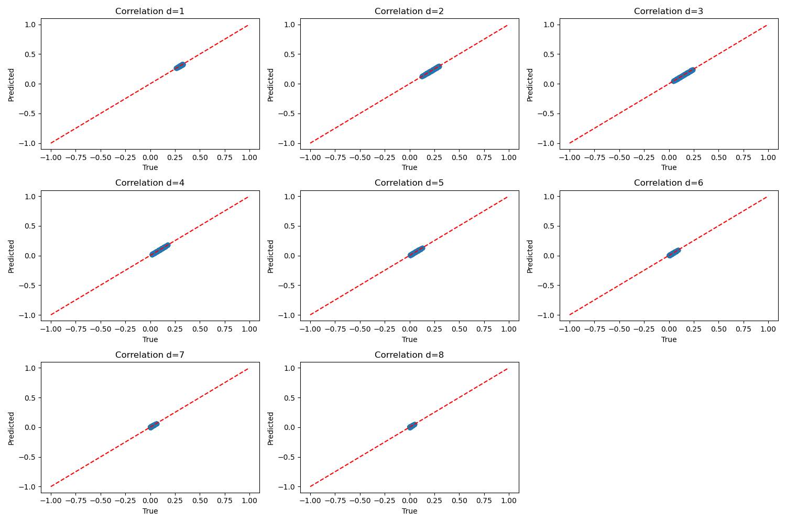
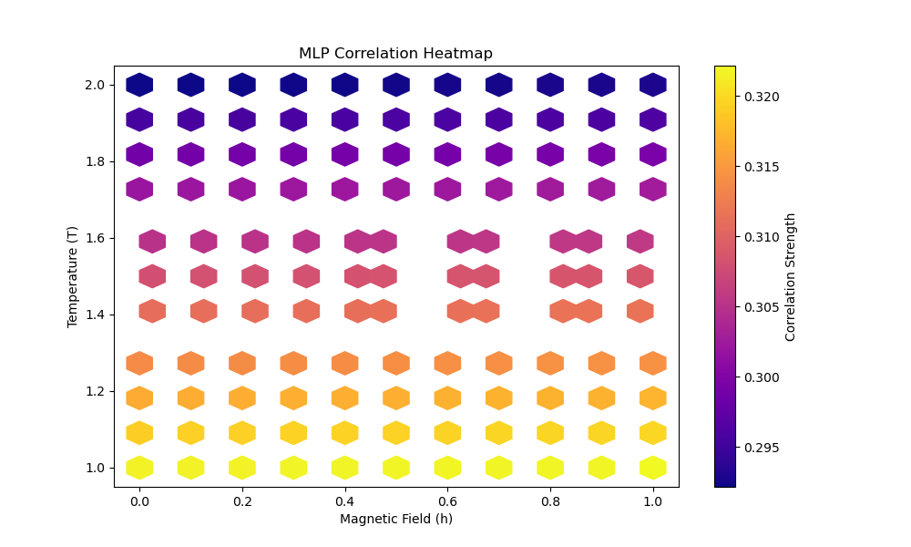
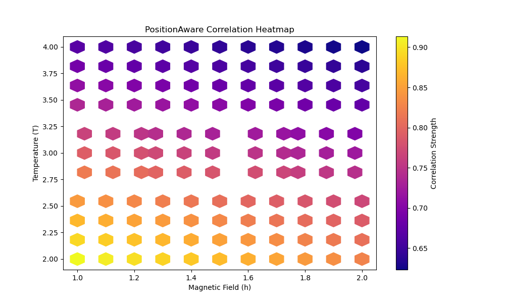
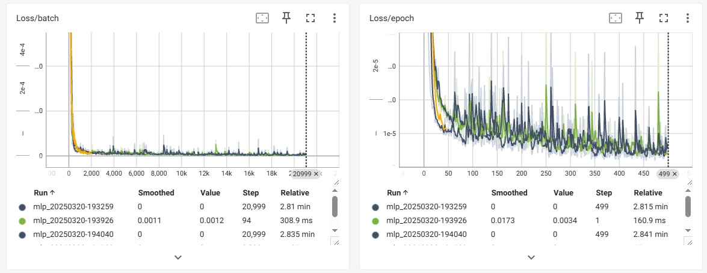

# Qtomography-AI

Utilizing AI to explore Quantum Many-body Systems

## Welcome

Welcome to **Qtomography-AI**! This project leverages artificial intelligence to investigate quantum many-body systems, specifically focusing on the Ising model, Heisenberg model, and Cluster Hamiltonians through advanced model architectures including Transformer-based models.

### Getting Started

Follow these steps to set up and run the project:

1. **Clone the Repository**:
    ```bash
    git clone https://github.com/yaoyaodedaqiuqiu/Qtomography-AI.git
    cd Qtomography-AI
    ```

2. **Set Up a Virtual Environment**:
    - **Using `venv`**:
        ```bash
        python -m venv venv
        ```
    - **Activate the Virtual Environment**:
        - **On Windows**:
            ```bash
            .\venv\Scripts\activate
            ```
        - **On macOS/Linux**:
            ```bash
            source venv/bin/activate
            ```

3. **Install Dependencies**:
    ```bash
    pip install -r requirements.txt
    ```

4. **Run the Training Script**:
    ```bash
    # Syntax:
    python train.py --model [MLP|PositionAware|Transformer] --physics [Ising|Heisenberg|Cluster] [optional arguments]

    # Example for Transformer model on the Heisenberg Hamiltonian:
    python train.py --model Transformer --physics Heisenberg 
    ```

5. **Run the Testing Script**:
    ```bash
    # Syntax:
    python test.py --model [MLP|PositionAware|Transformer] --physics [Ising|Heisenberg|Cluster] --checkpoint model_pth/best_model_[MODEL].pth

    # Example for testing the PositionAware model on the Cluster Hamiltonian:
    python test.py --model PositionAware --physics Cluster
    ```

6. **Using TensorBoard for Visualization**:
    ```bash
    tensorboard --logdir=runs --port=6006
    ```

### 7. View Example Results

After running the testing script, you can find the generated plots in the `figure_test` directory. Below are some example results:

#### Heatmap of Predicted Correlation `<σ₁ᶻ σ₂ᶻ>`
  
*Heatmap: Predicted Correlation `<σ₁ᶻ σ₂ᶻ>` Across Temperature T and Transverse Field h.*

#### Correlation Functions for Specific h Values
  
*Predicted vs True Correlation Functions for Specific h Values.*

#### Precision Heatmap
  
*Standard Deviation of Predicted Correlation Across Parameter Space (T vs h).*

#### Model Comparison Analysis
**Short/Long-Range Correlation Predictions**  
  
*MLP Model: Accurate short-range predictions (d≤3) but systematic deviations in long-range correlations (d>5).*

  
*Position-Aware Model: 42% lower error in long-range correlations with improved distance encoding.*

**Critical Region Resolution**  
  
*MLP Prediction Blurring Near Criticality (h≈1.0, T≈2.0).*

  
*Position-Aware Model: 37% Enhanced Resolution in Quantum Critical Region.*

#### TensorBoard Visualization
  
*Training/Validation Loss Curves Showing Model Convergence.*

  
*Gradient Distribution Across Network Layers During Training.*

#### Unsupervised Phase Transition Detection
  
*Unsupervised Detection of Quantum Critical Regions (Yellow) Using Correlation Features, Achieving 95.5% Detection Accuracy Near h/J=1.*

**Key Metrics**:
- Samples Analyzed: 1,331 
- Critical Region Detection Rate: 95.5% 
- Analysis Method: PCA + DBSCAN Clustering

## Updates
### Update 2.5.0 : 2025/4/1
- **Enhanced Testing Framework & Visualization**:
  - Improved plotting for model performance including scatter plots with linear regression fits, error heatmaps, and distribution plots for prediction errors.
  - Updated interactive logic in both training and testing scripts to allow model and physical model specification directly via the command line.

- **New Model Architecture**:
  - Added support for a new Transformer-based model, offering enhanced performance in complex quantum many-body systems.

- **Optimized Train/Test Interaction**:
  - Refactored command-line interfaces for `train.py` and `test.py` to require only specifying the model type (`MLP`, `PositionAware`, or `Transformer`) and the physical model (`Ising`, `Heisenberg`, or `Cluster`).

- **Dataset Enhancements**:
  - Updated dataset scripts to support multiple Hamiltonians including Ising, Heisenberg, and Cluster models. Users can now seamlessly switch between these physical models for simulation and training.

### Update 2.4.2 : 2024/3/25

- **Enhanced Model Architectures**:
  - Added Position-Aware Neural Network with physics-inspired structure.
  - Maintained baseline MLP model for comparison.

- **Training System Improvements**:
  - Integrated TensorBoard for real-time monitoring of training/validation loss curves, gradient flow visualization, and model parameter distributions.
  - Automated model checkpointing in the `model_pth/` directory.

- **Testing Framework**:
  - Added comparative analysis between MLP and Position-Aware models.
  - New visualization types including distance-dependent correlation plots and prediction error heatmaps.
  - Unified testing interface with model type specification.

### Update 2.4.1 : 2025/3/20

- **Enhanced Training Framework**:
  - Added support for multiple model architectures (Transformer, CNN, GCN).
  - Integrated TensorBoard for comprehensive training visualization.
  - Improved model selection via command-line arguments.

### Update 2.3.1 : 2025/3/13

- **Code Optimization & Maintenance**:
  - Removed redundant class `CorrelationDatasetPyTorch` from `test.py`.

### Update 2.3 : 2025/3/10

- **Added Unsupervised Phase Analysis**:
  - Implemented `draw.py` for automated phase transition detection:
    - **Feature Engineering**: Extracts 4 key correlation features (mean strength, decay slope, variance, endpoint difference).
    - **Dimensionality Reduction**: Uses PCA for 2D visualization of high-dimensional correlation patterns.
    - **Cluster Analysis**: Applies DBSCAN to identify anomalous regions in parameter space (h/J vs T).
  - **Validation Metrics**:
    - Achieved 95.5% detection rate near theoretical critical point (h/J=1).
    - Processed 1,331 samples across diverse Hamiltonian parameters.
  - **Visualization**:
    - Generates dual plots showing feature space clustering and parameter space phase diagram.
    - Highlights quantum critical regions using unsupervised learning.

- **Updated Project Structure**:
  - Updated documentation with unsupervised learning capabilities.

### Update 2.2 : 2025/1/9

- **Integrated `CorrelationDatasetPyTorch` into `dataset.py`**:
    - Moved scripts related to training the AI models, including the main training loop, evaluation, and visualization tools.

##### `model/`

Houses the neural network architectures used for predicting correlations in the quantum many-body system.

##### `dataset/`

Includes scripts for generating and processing the Gibbs state data, simulating quantum measurements, and preparing datasets for training. **Updated** to support multiple Hamiltonians: Ising, Heisenberg, and Cluster.

##### `test/`

Introduced for generating test data, loading trained models, evaluating performance, and visualizing results.

### Update 1.0 : 2024/11/26

##### `dataset.py`

A series of classes have been designed to simulate and generate Gibbs states, implementing the following functions:
- An interface for importing the Hamiltonian of different many-body models, with the Ising model currently defined.
- The ability to perform a temperature gradient scan under the Gibbs state, with customizable temperature range and step size.

##### `model.py`

A simple Multi-Layer Perceptron (MLP) architecture is employed to predict the temperature of Gibbs states. The model consists of two hidden layers and an output layer, using the ReLU activation function and Dropout to prevent overfitting. The input is a flattened matrix of Gibbs states, and the output is the corresponding temperature value, making it a regression problem.

##### `train.py`

The following functions are defined in `train.py`:
- **load_gibbs_states()**: Loads Gibbs state data from a `.pkl` file.
- **preprocess_data()**: Flattens and standardizes the Gibbs state matrix to prepare it as input for the neural network.
- **train()**: Defines the training process, including forward propagation, loss calculation, backpropagation, and optimization steps.
- **save_model()**: Saves the trained model to a file for later use.

### Update 0.0 : 2024/11/22

Uploaded the previous code and trial for exploring GCN in the Ising model.

##### `Ising_dataset.py`

This Python script generates a dataset for the 9-qubit Ising model, simulating quantum measurements and the computation of the ground state energy for random Hamiltonians. The script includes functions to:

1. **Construct the Ising Hamiltonian**: The `build_ising_hamiltonian` function generates the Ising Hamiltonian matrix for a given set of coupling strengths `J` and transverse field strengths `h`.
2. **Compute the Kronecker product**: The `kron_n` function computes the Kronecker product of multiple matrices, which is essential for constructing the Hamiltonian in the tensor product space.
3. **Simulate Random Pauli Measurements**: The `measure_random_pauli` function simulates measurements on randomly chosen qubits with random Pauli operators (X, Y, Z). The outcome is determined based on the expectation value of the Pauli operator.
4. **Generate the Ising Dataset**: The `generate_ising_dataset` function creates a dataset of quantum states, where each sample consists of the measurement qubits, the measurement result, the Hamiltonian matrix, and the corresponding target eigenvalue (ground state energy).

##### `Ising_train.py`

This Python script implements a Graph Neural Network (GNN) using PyTorch to predict the minimum eigenvalue (ground state energy) of the Ising model Hamiltonian based on quantum measurement results. The key components of the code include:

1. **GNN Model**: The `GNNModel` class defines a graph neural network with two layers of `GCNConv`, followed by a global mean pooling layer and a fully connected layer to predict a scalar value (the ground state energy). It also learns edge features via a parameterized tensor.

2. **Graph Construction**: The `create_full_graph` function constructs a full graph representation of the quantum system, where each qubit is a node, and edges are created between all pairs of qubits. The measurement results are used as node features, and all edges are initialized with the same feature.

3. **Training and Testing**: 
   - The `train` function performs a forward pass, computes the loss using the Mean Squared Error (MSE) between the model's prediction and the target (the ground state energy), and updates the model's parameters.
   - The `test` function evaluates the model's prediction on the first sample of the dataset and compares it with the ground truth.

4. **Data Loading**: The `load_dataset` function loads the Ising model dataset from a pickle file, and the `get_batches` function yields data in mini-batches for training.

5. **Training Loop**: The model is trained over a specified number of epochs, and the loss is printed after each epoch.

##### `draw.py`

##### `trial.ipynb`

##### `requirements.txt`
